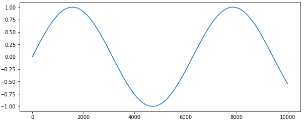
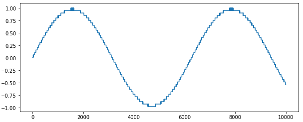

# What is this repo?
- Simulate ADC quantizations in python

- Fast Simulations using Numpy

- Can add noise for your design optimization!

# Very simple SAR Simulation
```python
# ADCBIT
BIT = 12

# ADC noise
noise = 2/2**BIT # noise is 2LSB

# create ADC
adc = SAR(BIT, noise, 0, 0, 2)

# ADC conversion
adcout = adc.forward_fft(input, plot=True)
```
```sh
Simulating a 12 bit SAR ADC
Capacitor mismatch not included
plotting conversion results


SNDR: [64.12131504]
ENOB: [10.35902243]
```

# Further usage
```python
# example.py

from sar import SAR, normalize_input
import numpy as np
import matplotlib.pyplot as plt

#bit = number of bits in ADC
#ncomp = noise of the comparator
#ndac = noise of the c-dac
#nsamp = sampling kT/C noise
#radix = radix of the C-DAC

# make a ideal sin signal
adcin = np.sin(np.arange(0, 10, 0.001))

# This simulates a standard 6-bit ADC
bit = 6
ncomp = 0.001
ndac = 0
radix = 2
nsamp = 0

# Define ADC
myadc = SAR(bit, ncomp, ndac, nsamp, radix)

# Normalize your input
norm_input, center, maxbin = normalize_input(adcin)

# Run ADC
adcout=myadc.forward(norm_input)

# Rescale ADC output to original
adcout, _ , _ = normalize_input(adcout)
adcout = adcout * maxbin + center

#print it.
print(adcout)
plt.plot(adcin)
plt.show()
plt.plot(adcout)
plt.show()
```

## PLot results



